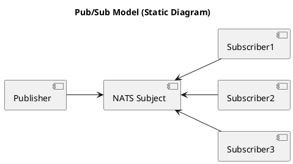
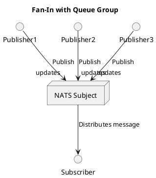

# Going NATS!

...

---

# Going NATS!

1. Hva er NATS?
2. Hvorfor bruker vi NATS?
3. Hva bruker vi NATS til?
4. Hvordan virker NATS?

La oss gå NATS, sammen!

---

# Hva er NATS?

NATS er et open-source meldingssystem, designet for å levere enkel, rask og pålitelig kommunikasjon mellom applikasjoner og enheter.

> Neural Autonomic Transport System 

NATS er et prosjekt under CNCF paraplyen og har vært et "incubating project" siden 2018.

---

# Hva er NATS?

Egenskaper:

- Høy ytelse - Designet for ekstrem hastighet og lav forsinkelse. *Millioner av meldinger i sekundet*.
- Lettvekt - Minimalt ressursbrukt. Enkelt å sette opp og bruke.
- Distribuert - Skalerbart og tilgjengelig med støtte for klynger og avanserte topologier.
- Allsidig - Pub/Sub, Request/Reply, Queues, Streaming, KV, Object Store.
- Multi-tenant - Desentralisert autentisering og autorisasjon.

NATS er skrevet i Go, og har klientbiblioteker for mer enn 40 språk.


---

# Hva er NATS?

- https://nats.io
- https://github.com/nats.io/
- cncf link

---

# Hvorfor bruker vi NATS?

...

---

# Hvorfor bruker vi NATS?

**Forenkling**

---

# Hvorfor bruker vi NATS?

**Forenkling**

- Enkle byggeklosser for å løse kompliserte utfordringer i distribuerte systemer.
- Stedsuavhengighet.
- Seperasjon og enkel integrasjon mellom systemer.
- Muliggjør integrasjon over data.
---

# Hva bruker vi NATS til?

...

---

# Hva bruker vi NATS til?

Fra et fugleperspektiv benytter vi NATS til:

- *"Service Mesh"*
- *"Data Mesh"* - (transport og tilgjengeliggjøring)

---

# Hva Bruker vi NATS til?

Mer konkret benytter vi NATS til:

- Kommunikasjon mellom mikrotjenester
    - Publish/Subscribe for å sende meldinger til mange mottakere.
    - Request/Reply for "synkron" eller mer presist asynkron kommunikasjon mellom tjenster.
- Streaming og behandling av meldinger
    - stuff 
---

# Hvordan virker NATS? 

> Dette høres ganske fett ut, men jeg trenger en mer nerdete tilnærming!

Skjønner, la oss komme i gang.

```
nats-server --jetstream
```

---

# Subjects

I NATS kommuniserer vi over *subjects*. Dette gir en navnebasert addressering i motsetning til de ulike ip, port og path baserte endepunktene vi vanligvis er nødt til å forholde oss til. 

Eksempel:
- "ordre" er her et subject vi kan benytte for å sende bestillinger.

---

# Hvordan bruker jeg så et subject?

På et subject, i dette tilfelle "ordre", kan vi publisere eller lytte (pub eller sub).

```bash
for i in $(seq 10)
do
    nats pub hello "{hello_message:${i}"
done
echo "Done..."
```

For et antiklimaks! Men, hva skjedde egentlig der?


---

# Hvordan lytte på et subject?

```bash
for i in $(seq 10)
do
    nats pub ordre "{ordreid:${i}}"
done
echo "Done..."
```

La oss åpne en ny terminal hvor vi også lytter, før vi kjører bash scriptet over.

```
nats sub ordre 
```
---

# Publish / Subscribe 

Den grunnleggende måten å "kommunisere" på i NATS er altså "publish/subscribe."

I utgangspunktet er *subjects* i NATS "ephemeral". De eksisterer så lenge noen publiserer og noen lytter. 

Er det ingen som lytter går meldingen ut i intet.  

---

# Men vent, vi kan gjøre mer med et subject

Et subject er ikke bare en flat struktur i NATS kan det være hierarkisk.

Vi kan utvide "chat" subject benyttet tidligere med meningsfyllt struktur:

- chat
- chat.$room
- chat.$user.dm
- chat.$user.poke

Basert på disse har vi tilført mening og dynamiske subjects. Vår banale "chat klient" har nå ulike subjects å lytte på.

---

# Det var jo litt kult, men hva med...

Vi kan jo ikke være helt "cowboy", vi har *krav!*.

- Vi trenger koordinering av meldinger!
- Hos oss trenger vi persistering!
- Og... 
- Samt...

Slapp av, vi kommer til det.

---

# Kø grupper

I pub/sub blir meldinger levert som *1:N*. Det vil si at alle som lytter vil får meldingen som blir publisert.

Ved å introdusere en "queue group" vil du fortsatt få meldinger etter *1:N* prinsippet, men du har nå muligheten til å koordinere meldinger for alle som lytter med samme kø navn.

Vi får med andre ord en lastbalansering av meldinger og vi kan sørge for at vi bare konsumerer meldingen en gang for et formål.

---

# Run go hello world

```go
package main

import "fmt"

func main() {
    fmt.Println("hello, world!")
}
```

---

# buggy 

becasue of code above?

---

# Publish / Subscribe (Fan-out)



---

# Publish / Subscribe (Fan-in)



---

# mermaid

```mermaid
~~~mermaid-ascii -
graph LR
A --> B & C
B --> C & D
D --> C
~~~
```

```
~~~cat
hello world
~~~
```
