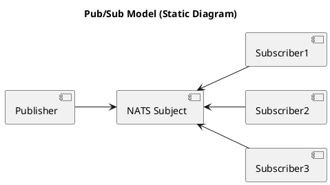
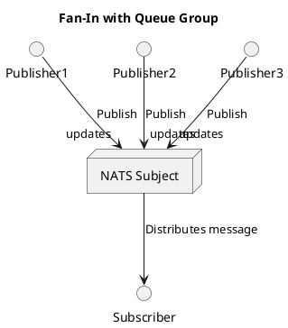

# Let's go NATS!

...

---

# Let's go NATS!

1. Hva er NATS?
2. Hvorfor bruker vi NATS?
3. Hva bruker vi NATS til?
4. Hvordan virker NATS?

La oss gå NATS, sammen!

---

# Hva er NATS?

NATS er et open-source meldingssystem, designet for å levere enkel, rask og pålitelig kommunikasjon mellom applikasjoner og enheter.

> Neural Autonomic Transport System 

NATS er et prosjekt under CNCF paraplyen og har vært et "incubating project" siden 2018.

---

# Hva er NATS?

Egenskaper:

- Høy ytelse - Designet for ekstrem hastighet og lav forsinkelse. *Millioner av meldinger i sekundet*.
- Lettvekt - Minimalt ressursbrukt. Enkelt å sette opp og bruke.
- Distribuert - Skalerbart og tilgjengelig med støtte for klynger og avanserte topologier.
- Allsidig - Pub/Sub, Request/Reply, Queues, Streaming, KV, Object Store.
- Tilgjengelig - Feiltoleranser, høy tilgjengelighet.
- Sikkerhet - Desentralisert autentisering og autorisasjon, TLS transport og JWT-based zero trust.

NATS er skrevet i Go, og har klientbiblioteker for mer enn 40 språk.

---

# Hva er NATS?

## Referanser

- https://nats.io
- https://nats.io/docs
- https://github.com/nats.io/
- https://www.cncf.io/projects/nats/ 
- https://natsbyexample.com/ 

---

# Hvorfor bruker vi NATS?

...

---

# Hvorfor bruker vi NATS?

**Forenkling**

---

# Hvorfor bruker vi NATS?

**Forenkling**

- Enkle byggeklosser for å løse kompliserte utfordringer i distribuerte systemer.
- Stedsuavhengighet. Multi-cloud og eget datasenter på "easy-mode".
- Seperasjon, robusthet og enkel integrasjon i og mellom systemer.
- Muliggjør integrasjon over data. Færre synkrone integrasjoner.

---

# Hva bruker vi NATS til?

...

---

# Hva bruker vi NATS til?

Fra et fugleperspektiv benytter vi NATS som:

- *"Service Mesh"* (load balancing/scale-out, retry, leveransegaranti og sikkerhet)
- *"Data Mesh"* - (transport, tilgjengeliggjøring og sikkerhet)


---

# Hva Bruker vi NATS til?

Mer konkret, benytter vi NATS til:

- Kommunikasjon mellom mikrotjenester
    - Publish/Subscribe for å sende meldinger til mange mottakere eller samle informasjon fra mange sendere.
    - Request/Reply for "synkron" eller mer presist asynkron kommunikasjon mellom tjenster.
- Streaming og behandling av meldinger
    - Arbeidskøer
    - Append-only-logs
    - Event sourcing mønstre
- Transport av dataprodukter til Analyse
    - Benytter arbeidskøer som verktøy for å speile en append-only-log.
    - Eksplisitt deling veldikeholdes av produktteamet.

---

# Hva Bruker vi NATS til?

Mer konkret, benytter vi NATS til:

- Som en bro (mesh/vpn) mellom Sky og eget datasenter.
    - NATS Infrastrukturen er tilgjengelig på Internett.
- Som object store for persistering av større filer.
    - Gjerne i kombinasjon med en persitent metadata strøm.
- Tilstandsmotor for Mattilsynets Plattform
    - Event drevet motor rundt ønsker lagret i KeyValue buckets. Aktive *reconcilers* rundt persisterte ønsker.
    - Inspirert av Kubernetes, men løftet et nivå høyere. Et ønske kunne ha vært, "jeg vil gjerne ha en kubernetes".
- Plattform integrasjoner, eksempelvis: 
    - Azure AD App Registration
    - IdPorten, Borger autentisering og autorisasjon.
    - Maskinporten, Maskin til maskin autentisering og autorisasjon.

---

# Hvordan virker NATS? 

> Dette høres ganske fett ut, men jeg trenger en mer nerdete tilnærming!
> Hvordan kan jeg komme i gang å jobbe med dette?

Skjønner, la oss komme i gang.

```
nats-server --jetstream
```
---

# Publish / Subscribe 

Den grunnleggende fundamentet for kommunikasjon i NATS er meldinger i en "publish/subscribe" modell.

En melding består av:
- Et subject
- Data i form av et `byte array`
- Så mange `message headers` du måtte ønske
- Et valgfritt `reply` addresse felt.

> Default meldingsstørrelse er opp til 1MB. Dette kan konfigureres og økes til maximum 64MB.

---

# Pulblish / Subscribe | Subjects

I NATS kommuniserer vi over `subjects`. Dette gir en navnebasert addressering i motsetning til de ulike ip, port og path baserte endepunktene vi vanligvis er nødt til å forholde oss til. 

I utgangspunktet er `subjects` i NATS *ephemeral*. De eksisterer så lenge noen publiserer og noen lytter. Er det ingen som lytter går meldingen ut i intet.

Hvordan kan et `subject` se ut?

```
hello
```

---

# Hvordan bruker jeg så et subject?

På et subject, i dette tilfelle `hello`, kan vi publisere noen meldinger:

```bash
for i in $(seq 10)
do
    nats pub hello "{hello_message:${i}"
done
echo "Done..."
```

For et antiklimaks! Men, hva skjedde egentlig der?


---

# Hvordan lytte på et subject?

La oss åpne en ny terminal hvor vi også lytter; før vi kjører bash scriptet over.

```
nats sub ordre 
```

før vi kjører bash scriptet over.


```bash
for i in $(seq 10)
do
    nats pub hello "{hello_message:${i}}"
done
echo "Done..."
```

---

# Men vent, vi kan gjøre mer med et subject

Et subject er ikke bare en flat struktur, i NATS kan det være et meningsfyllt hierarki.

Vi kan utvide "hello" subject benyttet tidligere med meningsfyllt struktur:

- hello.world 
- hello.meetup.hamar
- hello.${username}.dm

De 2 øverste er ganske åpenbare, men la oss utforske den siste som har en litt mer dynamisk struktur.

---

# Men vent, vi kan gjøre mer med et subject

```bash
nats pub hello.world "Yolo!"
nats pub hello.meetup.hamar "Tjenare!"
nats pub hello.ivar.dm "NATS er kult!" 
nats pub hello.arne.dm "Hei, har du testa disse NATS greiene!?"
nats pub hello.kari.dm "How about those yanks?"
echo "Done..."
```
---

# Publish / Subscribe (Fan-out)


---

# Publish / Subscribe (Fan-in)




---

# Det var jo litt kult, men hva med...

Vi kan jo ikke være helt "cowboy", vi har *krav!*.

- Vi trenger koordinering av meldinger!
- Hos oss trenger vi persistering!
- Og... 
- Samt...

Slapp av, vi kommer til det.

---

# Kø grupper

I pub/sub blir meldinger levert som *1:N*. Det vil si at alle som lytter vil får meldingen som blir publisert.

Ved å introdusere en "queue group" vil du fortsatt få meldinger etter *1:N* prinsippet, men du har nå muligheten til å koordinere meldinger for alle som lytter med samme kø navn.

Vi får med andre ord en lastbalansering av meldinger og vi kan sørge for at vi bare konsumerer meldingen en gang for et formål.

---

# Run go hello world

```go
package main

import "fmt"

func main() {
    fmt.Println("hello, world!")
}
```

---

# mermaid

```mermaid
~~~mermaid-ascii -
graph LR
A --> B & C
B --> C & D
D --> C
~~~
```

```
~~~cat
hello world
~~~
```
