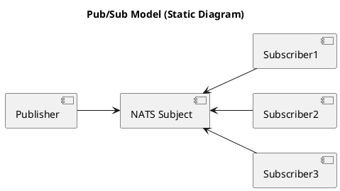
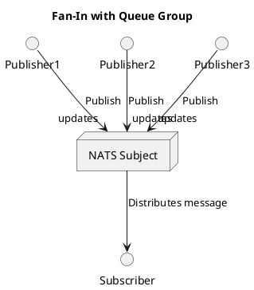

# Let's go NATS!

...

---

# Let's go NATS!

1. Hva er NATS?
2. Hvorfor bruker vi NATS?
3. Hva bruker vi NATS til?
4. Hvordan virker NATS?

La oss gå NATS, sammen!

---

# Hva er NATS?

NATS er et open-source meldingssystem, designet for å levere enkel, rask og pålitelig kommunikasjon mellom applikasjoner og enheter.

> Neural Autonomic Transport System 

NATS er et prosjekt under CNCF paraplyen og har vært et "incubating project" siden 2018.

---

# Hva er NATS?

Egenskaper:

- Høy ytelse - Designet for høy ytelse og lav forsinkelse. *Millioner av meldinger i sekundet*.
- Lettvekt - Minimalt ressursbrukt. Enkelt å sette opp og bruke.
- Distribuert - Skalerbart og tilgjengelig med støtte for klynger og avanserte topologier.
- Allsidig - Pub/Sub, Request/Reply, Queues, Streaming, KV, Object Store.
- Tilgjengelig - Feiltoleranser, høy tilgjengelighet.
- Sikkerhet - Desentralisert autentisering og autorisasjon, TLS transport og JWT-based zero trust.

NATS er skrevet i Go, og har klientbiblioteker for mer enn 40 språk.

---

# Hva er NATS?

## Referanser

- https://nats.io
- https://nats.io/docs
- https://github.com/nats.io/
- https://www.cncf.io/projects/nats/ 
- https://natsbyexample.com/ 

---

# Hvorfor bruker vi NATS?

...

---

# Hvorfor bruker vi NATS?

**Forenkling**

---

# Hvorfor bruker vi NATS?

**Forenkling**

- Enkle byggeklosser for å løse kompliserte utfordringer i distribuerte systemer.
- Stedsuavhengighet. Multi-cloud og eget datasenter på "easy-mode".
- Seperasjon, robusthet og enkel integrasjon i og mellom systemer.
- Muliggjør integrasjon over data. Færre synkrone integrasjoner.

---

# Hva bruker vi NATS til?

...

---

# Hva bruker vi NATS til?

Fra et fugleperspektiv benytter vi NATS som:

- *"Service Mesh"* (load balancing/scale-out, retry, leveransegaranti og sikkerhet)
- *"Data Mesh"* - (transport, tilgjengeliggjøring og sikkerhet)


---

# Hva Bruker vi NATS til?

Mer konkret, benytter vi NATS til:

- Kommunikasjon mellom mikrotjenester
    - Publish/Subscribe for å sende meldinger til mange mottakere eller samle informasjon fra mange sendere.
    - Request/Reply for "synkron" eller mer presist asynkron kommunikasjon mellom tjenster.
- Streaming og behandling av meldinger
    - Arbeidskøer
    - Append-only-logs
    - Event sourcing mønstre
- Transport av dataprodukter til Analyse
    - Benytter arbeidskøer som verktøy for å speile en append-only-log.
    - Eksplisitt deling veldikeholdes av produktteamet.

---

# Hva Bruker vi NATS til?

Mer konkret, benytter vi NATS til:

- Som en bro (mesh/vpn) mellom Sky og eget datasenter.
    - NATS Infrastrukturen er tilgjengelig på Internett.
- Som object store for persistering av større filer.
    - Gjerne i kombinasjon med en persitent metadata strøm.
- Tilstandsmotor for Mattilsynets Plattform
    - Event drevet motor rundt ønsker lagret i KeyValue buckets. Aktive *reconcilers* rundt persisterte ønsker.
    - Inspirert av Kubernetes, men løftet et nivå høyere. Et ønske kunne ha vært, "jeg vil gjerne ha en kubernetes".
- Plattform integrasjoner, eksempelvis: 
    - Azure AD App Registration
    - IdPorten, Borger autentisering og autorisasjon.
    - Maskinporten, Maskin til maskin autentisering og autorisasjon.

---

# Hvordan virker NATS? 

> Dette høres ganske fett ut, men jeg trenger en mer teknisk tilnærming!
> Hvordan kan jeg komme i gang å jobbe med dette?

Skjønner, la oss komme i gang.

```
nats-server --jetstream
```
---

# Publish / Subscribe 

Det grunnleggende fundamentet for kommunikasjon i NATS er meldinger i en "publish/subscribe" modell.

En melding består av:
- Et subject
- Data i form av et `byte array`
- Så mange `message headers` du måtte ønske
- Et valgfritt `reply` addresse felt.

> Default meldingsstørrelse er opp til 1MB. Dette kan konfigureres og økes til maximum 64MB.

---

# Pulblish / Subscribe | Subjects

I NATS kommuniserer vi over `subjects` eller da emner på norsk. Dette gir en navnebasert addressering i motsetning til de ulike ip, port og path baserte endepunktene vi vanligvis er nødt til å forholde oss til. 

I utgangspunktet er `subjects` i NATS *ephemeral*. De eksisterer så lenge noen publiserer og noen lytter. Er det ingen som lytter går meldingen ut i intet.

Hvordan kan et `subject` se ut?

```
hello
```

---

# Hvordan bruker jeg så et subject?

På et subject, i dette tilfelle `hello`, kan vi publisere noen meldinger:

```bash
for i in $(seq 10)
do
    nats pub hello "{hello_message:${i}"
done
echo "Done..."
```

For et antiklimaks! Men, hva skjedde egentlig der?


---

# Hvordan lytte på et subject?

La oss åpne en ny terminal hvor vi også lytter; før vi kjører bash scriptet neders her.

Slik kan du lytte på et subject:
```
nats sub ordre 
```


La oss publishere noen medlinger igjen:
```bash
for i in $(seq 10)
do
    nats pub hello "{hello_message:${i}}"
done
echo "Done..."
```

---

# Men vent, vi kan gjøre mer med et subject

Et subject er ikke bare en flat struktur, i NATS kan det være et meningsfyllt hierarki.

Vi kan utvide "hello" subject benyttet tidligere med meningsfyllt struktur:

- hello.world 
- hello.meetup.hamar
- hello.{username}.dm

De 2 øverste er ganske åpenbare, men la oss utforske den siste som har en litt mer dynamisk struktur.

---

# Men vent, vi kan gjøre mer med et subject

La oss publiser disse meldingene noen ganger og leke med hvordan vi lytter:
```bash
nats pub hello.world "Yolo!"
nats pub hello.meetup.hamar "Tjenare!"
nats pub hello.ivar.dm "NATS er kult!" 
nats pub hello.arne.dm "Hei, har du testa disse NATS greiene!?"
nats pub hello.kari.dm "How about those yanks?"
echo "Done..."
```

---

# Publish / Subscribe (Fan-out)


---

# Publish / Subscribe (Fan-in)



---

# Request-Reply

En NATS melding kan inneholde en `reply` verdi. Her kan vi få et dynamisk unikt `subject` en klient forventer å få et svar på sin publiserte forespørsel.

Server:
```
nats reply commands --command "echo 'Processed command: {{Request}}'" -q meetup-commands
```

Client:
```go
///package main
///
///import (
///    "fmt"
///    "log"
///    "time"
///    "github.com/nats-io/nats.go"
///)

func main() {
///    // Connect to NATS
///    nc, err := nats.Connect(nats.DefaultURL) // Default is nats://127.0.0.1:4222
///    if err != nil {
///    	log.Fatalf("Error connecting to NATS: %v", err)
///}
///defer nc.Close()
    timeout := 2 * time.Second 
    reply, err := nc.Request("commands", []byte("reboot"), timeout)
    if err != nil {
        log.Fatalf("Error sending request: %v", err)
    }
	fmt.Printf("Received reply: %s\n", string(reply.Data))
}
```

---

# Koordinering

Noen la kanskje merke til `-q meetup-commands`?

Dette er en kø gruppe (queue group). Dette benyttes for *koordinering* for å oppnå:

- Arbeidsfordeling
- Skalerbarhet
- Feiltolereanse

---

# Persistering

Vi har til nå bare snakket om funksjonalitet som finnes i det som omtales som **NATS Core**.

For persistering av meldinger finnes det et overbygg som heter **Jetstream**.

Som med alt annet i NATS så baserer dette seg i sin enkelhet å persistere meldinger på `subjects` du er interessert i og samler dette i en `jetstream`.

Dette gir oss fundamentet for `streaming` og `event sourcing` mønstre.

---

# Persistering - Retention Policies

**Jetstream** er fleksibelt og understøtter en masse bruksområder. 

Vi har 3 ulike `Retention Policies`:
- Limits (default)
    - Meldinger beholdes inntil strømmen treffer sin konfigurerte størrelse eller antall meldinger.
- Interest
    - Meldinger beholdes inntil alle registrerte konsumenter på har motatt og `Acked` meldingen. 
 - WorkQueue
    - Medlinger beholdes inntil en meldinger har blitt konsumert og `Acked`.

---

# Persistering - Retention Parameters

I tillegg til `Retention Policies` har vi også `Retention Parameters` for enda bedre kontroll på hvordan meldinger persisteres.

## Retention Parameters

- **Max Age** - Hvor lenge en melding kan ligge på en strøm
- **Max Messages** - Hvor mange meldinger vi gidder å ta vare på
- **Max Bytes** - Hvor mye data vi gidder å ta vare på

---

# Persistering - La oss lage en strøm

Gitt følgende `subjects` så ønsker vi å lage en `limit` basert strøm.

- sensors.pizzanini.temp
- sensors.pizzanini.co2
- sensors.pizzanini.humidity

Kode for programatisk opprettelse:

```go
///package main
///
///import (
///	"fmt"
///
///	"github.com/nats-io/nats.go"
///)

func main() {
///	// Connect to the NATS server
///	nc, err := nats.Connect("nats://localhost:4222")
///	if err != nil {
///		fmt.Printf("Error connecting to NATS: %v", err)
///     return
///	}
///	defer nc.Close()
///
///	// Create a JetStream context
///	js, err := nc.JetStream()
///	if err != nil {
///		fmt.Printf("Error creating JetStream context: %v", err)
///        return
///	}
///
    streamConfig := &nats.StreamConfig{
        Name:     "SENSORS",
        Subjects: []string{"sensors.pizzanini.temp", "sensors.pizzanini.humidity", "sensors.pizzanini.co2"},
        Storage:  nats.MemoryStorage,
        Replicas: 1,
    }
    _, err = js.AddStream(streamConfig)
    if err != nil {
        fmt.Printf("Error adding stream: %v", err)
        return
    }
    fmt.Println("Stream successfully created!")
}
```

---

# Persistering - La oss få litt data på strømmen

```bash
SUBJECTS=("sensors.pizzanini.temp" "sensors.pizzanini.humidity" "sensors.pizzanini.co2")

generate_random_value() {
  echo $((RANDOM % 100))  # Random integer between 0 and 99
}

for subject in "${SUBJECTS[@]}"; do
  for i in {1..10}; do
    value=$(generate_random_value)
    nats pub "$subject" "$value" 
  done
done

echo "Publishing complete!"

```

---

# Persistering - Status på strømmen

Hva fikk vi:

```bash
nats stream ls 
```

---

# Persistering - La oss bruke dataene på strømmen til noe banalt

```go
package main

import (
	"fmt"
	"strconv"

	"github.com/nats-io/nats.go"
)

func main() {
	// Connect to the NATS server
	nc, err := nats.Connect("nats://localhost:4222")
	if err != nil {
		fmt.Printf("Error connecting to NATS: %v\n", err)
		return
	}
	defer nc.Close()

	// Create a JetStream context
	js, err := nc.JetStream()
	if err != nil {
		fmt.Printf("Error creating JetStream context: %v\n", err)
		return
	}

	// Define the stream and subject
	stream := "SENSORS"
	subject := "sensors.pizzanini.temp"

	// Create an ephemeral consumer
	consumer, err := js.AddConsumer(stream, &nats.ConsumerConfig{
		AckPolicy:     nats.AckExplicitPolicy,
		FilterSubject: subject,
	})
	if err != nil {
		fmt.Printf("Error creating ephemeral consumer: %v\n", err)
		return
	}

	// Start consuming messages using the ephemeral consumer
	sub, err := js.Consume(stream, consumer.Name)
	if err != nil {
		fmt.Printf("Error starting consumer subscription: %v\n", err)
		return
	}
	defer sub.Stop()

	fmt.Println("Consuming messages with ephemeral consumer...")

	var sum, count float64

	// Consume messages
	for msg := range sub.Messages() {
		if msg == nil {
			break
		}

		// Parse the message data
		value, err := strconv.ParseFloat(string(msg.Data), 64)
		if err != nil {
			fmt.Printf("Invalid temperature value: %s\n", msg.Data)
			msg.Nak() // Negative acknowledgment
			continue
		}

		// Update the sum and count
		sum += value
		count++

		// Acknowledge the message
		msg.Ack()
	}

	// Calculate and display the average
	if count == 0 {
		fmt.Println("No temperature data found.")
	} else {
		average := sum / count
		fmt.Printf("Average temperature: %.2f\n", average)
	}
}

```
