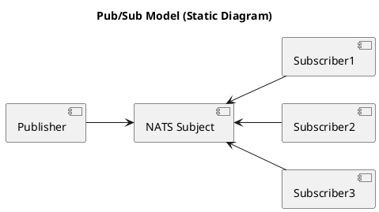
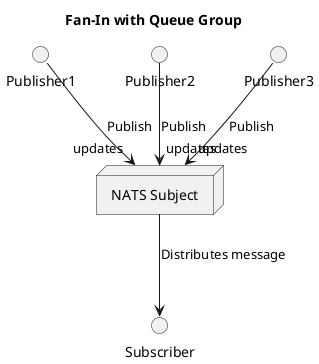

# Let's go NATS!

...

---

# Let's go NATS!

1. Hvorfor bruker vi NATS?
2. Hva er NATS?
3. Hva bruker vi NATS til?
4. Hvordan virker NATS?

La oss gå NATS, sammen!

---
# Hvorfor bruker vi NATS?

...

---

# Hvorfor bruker vi NATS?

**Forenkling**

---

# Hvorfor bruker vi NATS?

**Forenkling**

- Enkle byggeklosser for å løse kompliserte utfordringer i distribuerte systemer.
- Stedsuavhengighet. Multi-cloud og eget datasenter på "easy-mode".
- Seperasjon, robusthet og enkel integrasjon i og mellom systemer.
- Muliggjør integrasjon over data.

---

# Hva er NATS?

NATS er et open-source meldingssystem, designet for å levere enkel, rask og pålitelig kommunikasjon mellom applikasjoner og enheter.

> Neural Autonomic Transport System 

NATS er et prosjekt under CNCF paraplyen og har vært et "incubating project" siden 2018.

---

# Hva er NATS?

Egenskaper:

- Høy ytelse - Designet for høy ytelse og lav forsinkelse. *Millioner av meldinger i sekundet*.
- Lettvekt - Minimalt ressursbrukt. Enkelt å sette opp og bruke.
- Distribuert - Skalerbart og tilgjengelig med støtte for klynger og avanserte topologier.
- Allsidig - Pub/Sub, Request/Reply, Queues, Streaming, KV, Object Store.
- Tilgjengelig - Feiltoleranser, høy tilgjengelighet.
- Sikkerhet - Desentralisert autentisering og autorisasjon, TLS transport og JWT-based zero trust.

NATS er skrevet i Go, og har klientbiblioteker for mer enn 40 språk.

---

# Hva bruker vi NATS til?

...

---

# Hva bruker vi NATS til?

Fra et fugleperspektiv benytter vi NATS som:

- *"Service Mesh"* (load balancing/scale-out, retry, leveransegaranti og sikkerhet)
- *"Data Mesh"* - (transport, tilgjengeliggjøring og sikkerhet)


---

# Hva Bruker vi NATS til?

Mer konkret, benytter vi NATS til:

- Kommunikasjon mellom mikrotjenester
    - Publish/Subscribe for å sende meldinger til mange mottakere eller samle informasjon fra mange sendere.
    - Request/Reply for "synkron" eller mer presist asynkron kommunikasjon mellom tjenster.
- Streaming og behandling av meldinger
    - Arbeidskøer
    - Append-only-logs
    - Event sourcing mønstre
- Transport av dataprodukter til Analyse
    - Benytter arbeidskøer som verktøy for å speile en append-only-log.
    - Eksplisitt deling veldikeholdes av produktteamet.

---

# Hva Bruker vi NATS til?

Mer konkret, benytter vi NATS til:

- Som en bro (mesh/vpn) mellom Sky og eget datasenter.
    - NATS Infrastrukturen er tilgjengelig på Internett.
- Som object store for persistering av større filer.
    - Gjerne i kombinasjon med en persitent metadata strøm.
- Tilstandsmotor for Mattilsynets Plattform
    - Event drevet motor rundt ønsker lagret i KeyValue buckets. Aktive avstemming rundt persisterte ønsker.
    - Inspirert av Kubernetes, men på et lavere nivå. Et ønske kunne ha vært, "jeg vil gjerne ha en kubernetes".
    - Eksempel på eksisterende ønsker:
        - Jeg vil ha et mijlø i sky
        - Azure AD App Registration
        - IdPorten, Borger autentisering og autorisasjon.
        - Maskinporten, Maskin til maskin autentisering og autorisasjon.

---

# Hvordan virker NATS? 

> Dette høres ganske fett ut, men jeg trenger en mer teknisk tilnærming!
> Hvordan kan jeg komme i gang å jobbe med dette?

Skjønner, la oss komme i gang.

```
nats-server --jetstream
```
---

# Publish / Subscribe 

Det grunnleggende fundamentet for kommunikasjon i NATS er meldinger i en "publish/subscribe" modell.

En melding består av:
- Et subject
- Data i form av et `byte array`
- Så mange `message headers` du måtte ønske
- Et valgfritt `reply` addresse felt.

> Default meldingsstørrelse er opp til 1MB. Dette kan konfigureres og økes til maximum 64MB.

---

# La oss publisere noen meldinger 

På et `subject`, i dette tilfelle `hello`, kan vi publisere noen meldinger:

```bash
for i in $(seq 10)
do
    nats pub hello "{hello_message:${i}"
done
echo "Done..."
```

---

# Hvordan lytte på et subject?

La oss åpne en ny terminal hvor vi også lytter; før vi kjører bash scriptet nederst her.

Slik kan du lytte på et subject:
```
nats sub hello 
```

La oss publishere meldingene igjen:
```bash
for i in $(seq 10)
do
    nats pub hello "{hello_message:${i}}"
done
echo "Done..."
```

---

# Men vent, vi kan gjøre mer med et subject

Et `subject` er ikke bare et navn, i NATS kan det være et meningsfyllt hierarki.

Vi kan utvide **hello** subject benyttet tidligere med et hirarki som vi bruker til å tilføre mening og kontekst:

- hello.world 
- hello.meetup.hamar
- hello.{{username}}.dm

De 2 øverste er ganske åpenbare, men la oss utforske den siste som har en litt mer dynamisk struktur.

---

# Men vent, vi kan gjøre mer med et subject

La oss publiser disse meldingene noen ganger og leke med hvordan vi lytter:
```bash
nats pub hello.world "Yolo!"
nats pub hello.meetup.hamar "Tjenare!"
nats pub hello.ivar.dm "NATS er kult!" 
nats pub hello.arne.dm "Hei, har du testa disse NATS greiene!?"
nats pub hello.kari.dm "Fikk du med deg at Pizzanini bytter navn!?"
echo "Done..."
```

---

# Request-Reply

Server:
```
nats reply commands --command "echo 'Processed command: {{Request}}'" -q meetup-commands
```

Client:
```go
///package main
///
///import (
///    "fmt"
///    "time"
///    "github.com/nats-io/nats.go"
///)

func main() {
///    // Connect to NATS
///    nc, err := nats.Connect(nats.DefaultURL) 
///    if err != nil {
///    	fmt.Printf("Error connecting to NATS: %v", err)
///     return
///    }
///defer nc.Close()
    timeout := 2 * time.Second 
    reply, err := nc.Request("commands", []byte("reboot"), timeout)
    if err != nil {
        fmt.Printf("Error sending request: %v", err)
	return
    }
    fmt.Printf("Received reply: %s\n", string(reply.Data))
}
```

---

# Koordinering

Noen la kanskje merke til `-q meetup-commands`?

Dette er en kø gruppe (`queue group`). Dette kan benyttes for å oppnå:

- Arbeidsfordeling
- Skalerbarhet
- Feiltolereanse



 
---

# Persistering

Vi har til nå bare snakket om funksjonalitet som finnes i det som omtales som **NATS Core**.

For persistering av meldinger finnes det et overbygg som heter **Jetstream**.

Som med alt annet i **NATS** så baserer dette seg i sin enkelhet å persistere meldinger på `subjects` du er interessert i og samler dette i en `jetstream`.

Dette gir oss fundamentet for `streaming` og `event sourcing` mønstre.

---

# Jetstream - Retention Policies

**Jetstream** er fleksibelt og understøtter en masse bruksområder. 

Vi har 3 ulike `Retention Policies`:
- Limits (default)
    - Meldinger beholdes inntil strømmen treffer sin konfigurerte størrelse eller antall meldinger.
- Interest
    - Meldinger beholdes inntil alle registrerte konsumenter på strømmen har motatt og `Acked` meldingen. 
 - WorkQueue
    - Medlinger beholdes inntil meldinger har blitt konsumert og `Acked`.

---

# Jetstream - Retention Parameters

I tillegg til `Retention Policies` har vi også `Retention Parameters` for enda bedre kontroll på hvordan meldinger persisteres.

## Retention Parameters

- **Max Age** - Hvor lenge en melding kan ligge på en strøm
- **Max Messages** - Hvor mange meldinger vi gidder å ta vare på
- **Max Bytes** - Hvor mye data vi gidder å ta vare på

---

# Jetstream - La oss lage en strøm

Gitt følgende `subjects` så ønsker vi å lage en `limit` basert strøm.

- sensors.pizzanini.temp
- sensors.pizzanini.co2
- sensors.pizzanini.humidity

---

# Jetstream - La oss lage en strøm

Kode for programatisk opprettelse:

```go
///package main
///
///import (
///	"fmt"
///
///	"github.com/nats-io/nats.go"
///)

func main() {
///	// Connect to the NATS server
///	nc, err := nats.Connect("nats://localhost:4222")
///	if err != nil {
///		fmt.Printf("Error connecting to NATS: %v", err)
///     return
///	}
///	defer nc.Close()
///
///	// Create a JetStream context
///	js, err := nc.JetStream()
///	if err != nil {
///		fmt.Printf("Error creating JetStream context: %v", err)
///        return
///	}
///
    streamConfig := &nats.StreamConfig{
        Name:     "SENSORS",
        Subjects: []string{"sensors.pizzanini.temp", "sensors.pizzanini.humidity", "sensors.pizzanini.co2"},
        Storage:  nats.MemoryStorage,
        Retention: nats.LimitsPolicy,
        Replicas: 1,
    }
    _, err = js.AddStream(streamConfig)
    if err != nil {
        fmt.Printf("Error adding stream: %v", err)
        return
    }
    fmt.Println("Stream successfully created!")
}
```

---

# Jetstream - La oss få litt data på strømmen

```bash
SUBJECTS=("sensors.pizzanini.temp" "sensors.pizzanini.humidity" "sensors.pizzanini.co2")

generate_random_value() {
  echo $((RANDOM % 100))  # Random integer between 0 and 99
}

for subject in "${SUBJECTS[@]}"; do
  for i in {1..10}; do
    value=$(generate_random_value)
    nats pub "$subject" "$value" 
  done
done

echo "Publishing complete!"

```

---

# Jetstream - Status på strømmen

Hva fikk vi:

```bash
nats stream ls 
```

---

# Jetstream - La oss bruke dataene på strømmen til noe banalt

```go
///package main
///
///import (
///    "context"
///    "fmt"
///    "strconv"
///    "time"
///
///    "github.com/nats-io/nats.go"
///    "github.com/nats-io/nats.go/jetstream"
///)
var sum, count float64

func main() {
/// // Connect to the NATS server
/// nc, err := nats.Connect("nats://localhost:4222")
/// if err != nil {
/// fmt.Printf("Error connecting to NATS: %v\n", err)
/// return
/// }
/// defer nc.Close()

/// // Create a JetStream context
/// js, err := jetstream.New(nc)
/// if err != nil {
///	fmt.Printf("Error creating JetStream context: %v\n", err)
///	return
/// }
///
/// ctx, cancel := context.WithTimeout(context.Background(), 10*time.Second)
/// defer cancel()
///
/// // Create an ephemeral consumer
    consumer, err := js.CreateConsumer(ctx, "SENSORS", jetstream.ConsumerConfig{
      AckPolicy:         jetstream.AckExplicitPolicy,
      FilterSubject:     "sensors.pizzanini.temp",
      InactiveThreshold: 10 * time.Millisecond,
    })
///	if err != nil {
///		fmt.Printf("Error creating ephemeral consumer: %v\n", err)
///		return
///	}
///
/// fmt.Println("Consuming messages with ephemeral consumer...")
/// // Start consuming messages using the consumer

    subscription, err := consumer.Consume(func(msg jetstream.Msg) {
      value, err := strconv.ParseFloat(string(msg.Data()), 64)
      if err != nil {
        fmt.Printf("Invalid temperature value: %s\n", string(msg.Data()))
        msg.Nak() // Negative acknowledgment
      }
      sum += value
      count++
      msg.Ack()
    })
///	if err != nil {
///		fmt.Printf("Error starting consumer subscription: %v\n", err)
///		return
///	}
///	defer subscription.Stop()
///    time.Sleep(time.Second * 1)
///    if count == 0 {
///      fmt.Println("No temperature data found.")
///    } else {
///      average := sum / count
///      fmt.Printf("Average temperature: %.2f\n", average)
///    }
}
```
---

# Jetstream - Retention Policies

**Jetstream** er fleksibelt og understøtter en masse bruksområder. 

Vi har 3 ulike `Retention Policies`:
- Limits (default)
    - Meldinger beholdes inntil strømmen treffer sin konfigurerte størrelse eller antall meldinger.
- Interest
    - Meldinger beholdes inntil alle registrerte konsumenter på strømmen har motatt og `Acked` meldingen. 
 - WorkQueue
    - Medlinger beholdes inntil meldinger har blitt konsumert og `Acked`.

---

# Jetstream - Retention Parameters

I tillegg til `Retention Policies` har vi også `Retention Parameters` for enda bedre kontroll på hvordan meldinger persisteres.

## Retention Parameters

- **Max Age** - Hvor lenge en melding kan ligge på en strøm
- **Max Messages** - Hvor mange meldinger vi gidder å ta vare på
- **Max Bytes** - Hvor mye data vi gidder å ta vare på

---

# FIN - Men vent det er så mye mer

- Key/Value Store
- Object Store
- Dead Letter Queues
- Multitenancy
- Message Replay
- Autentisering og autorisasjon
- Deling
- Observerbarhet
- NATS Server Topologier
- MQTT
- WSS

Men vi setter en strek her for denne gang.

**Takk for oppmerksomheten!**

---

# Om presentasjonen 

Slide-"deck" er tilgjengelig på https://github.com/laetho/goingnats.

Software som benyttes er "slides" på https://github.com/maaslalani/slides. Men det er også mulig å se på innholdet som ren markdown.

> "slides" programmet er tilgjengelig via homebrew for de som er på Mac.

---

# Referanser 

- https://nats.io
- https://nats.io/docs
- https://github.com/nats.io/
- https://www.cncf.io/projects/nats/ 
- https://natsbyexample.com/ 

---

# Publish / Subscribe (Fan-out)


---

# Publish / Subscribe (Fan-in)



---

# Jetstream - Consumer

En `consumer` representerer en klient, eller en samling med klienter om `queue groups` benyttes i kombinasjon med `consumer`. 

| **Consumer Type**              | **Queue Group**    | **Bruksområde**                                                                 |
|--------------------------------|--------------------|---------------------------------------------------------------------------------|
| **Ephemeral Consumer**         | **Uten Queue Group** | - Midlertidig abonnent uten behov for lastbalansering.                          |
|                                |                    | - Engangsabonnement eller testing av meldingsflyt.                             |
| **Ephemeral Consumer**         | **Med Queue Group** | - Lastbalansering mellom flere midlertidige prosesser.                         |
|                                |                    | - Passer for kortvarige oppgaver som kan tolerere meldingtap.                  |
| **Durable Consumer**           | **Uten Queue Group** | - Individuelle abonnenter som trenger å gjenopprette tilstand ved frakobling.     |
|                                |                    | - For langvarig prosessering med garantier for meldingstilstand.               |
| **Durable Consumer**           | **Med Queue Group** | - Lastbalansering mellom flere prosesser med vedvarende tilstand.                 |
|                                |                    | - Brukes der det er kritisk at ingen meldinger går tapt selv uten aktive medlemmer. |


---

# Jetstream - Consumer tilstand

Tilstand for en consumer refererer til informasjonen som lagres for å holde rede på:

- Hvilke meldinger som allerede er behandlet (eller er under behandling).
- Acknowledgement status (hvilke meldinger som er ack’et og hvilke som må leveres på nytt).
- Andre konfigurasjonsdetaljer som påvirker oppførselen til consumeren.

All klient eller da `consumer` tilstand blir lagret på **NATS** serveren.

| **Scenario**                            | **Consumer-type**   | **Hvordan tilstand brukes**                                                   |
|-----------------------------------------|---------------------|--------------------------------------------------------------------------------|
| Testing eller kortvarige oppgaver       | Ephemeral           | Tilstand ikke lagret (in-memory) – meldinger behandles kun i sanntid.                     |
| Robust meldingbehandling                | Durable             | Offset lagres – behandlingen fortsetter der den slapp ved avbrudd.            |
| Kritiske arbeidsflyter med retries      | Durable             | Ack-status lagres for å sikre at meldinger ikke behandles mer enn én gang.    |
| Lastbalansering mellom flere prosesser  | Durable + Queue     | Tilstand lagres for hele gruppen – sikrer kontinuitet selv uten aktive medlemmer. |

-

